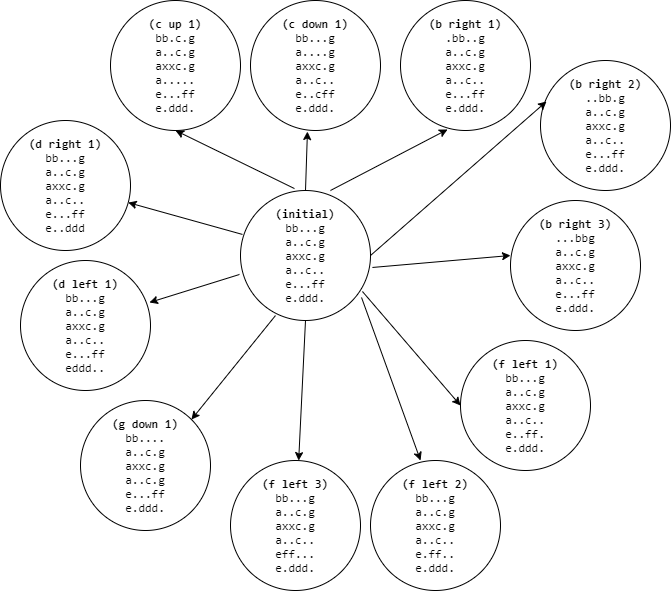
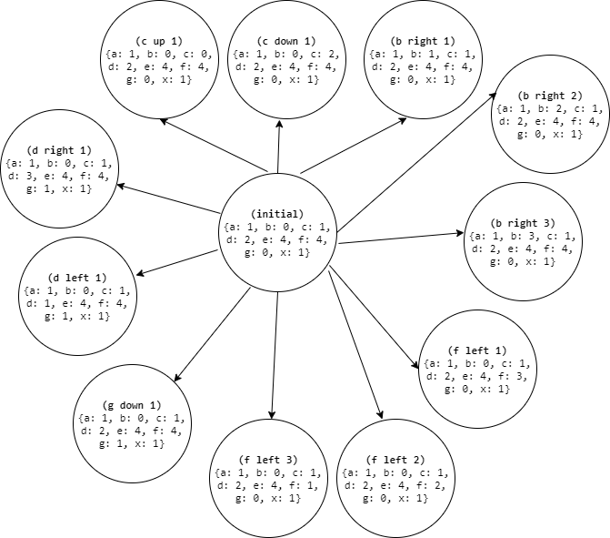

# RushHour Solver

Team Member(s): Nathan Esau

Algorithm(s): Dijkstra's Algorithm

Languages(s): Python, C++

Jam(s): http://www.mathsonline.org/game/jam.html

## Results

Total solve time for all 40 jams from http://www.mathsonline.org/game/jam.html:

| Language | Total Solve Time |
| -------- | ---------------- | 
| C++ | 5.8 seconds |
| Python | 10.45 seconds |
| Java | 11.73 seconds |

## Explanation

### Dijkstra's algorithm

it is a breadth-first search algorithm on an unweighted graph using a priority queue.

#### Case #1: Simple Maze

Suppose we have the following maze, where ``W`` represents a wall and ``.`` represents a tile you can walk on. We are trying to go from bottom left corner to top right corner.

```
. . . .
W W . W
. . . .
. . . .
```

One of the possible shortest paths is URRRURR:

```
. . _ _
W W | W
_ _ _ .
| . . .
```

Here is the graph for the maze:


Which can also be represented as:

<!-- 
def build_graph(maze):
    board = [line.split() for line in maze.splitlines()]
    graph = {}
    for i in range(len(board)):
        for j in range(len(board[i])):
            graph[(i,j)] = set()
            if i-1 >= 0 and board[i][j] == '.':
                graph[(i,j)].add((i-1, j))
            if i+1 < len(board) and board[i][j] == '.':
                graph[(i,j)].add((i+1, j))
            if j-1 >= 0 and board[i][j] == '.':
                graph[(i,j)].add((i, j-1))
            if j+1 < len(board[i]) and board[i][j] == '.':
                graph[(i,j)].add((i, j+1))
    return graph

maze = '. . . .\nW W . W\n. . . .\n. . . .'
graph = build_graph(maze)
print(graph)
-->

```python
graph = {
    (0, 0): {(0, 1), (1, 0)},
    (0, 1): {(0, 2), (0, 0), (1, 1)},
    (0, 2): {(1, 2), (0, 3), (0, 1)},
    (0, 3): {(1, 3), (0, 2)},
    (1, 0): set(),
    (1, 1): set(),
    (1, 2): {(1, 3), (1, 1), (0, 2), (2, 2)},
    (1, 3): set(), 
    (2, 0): {(3, 0), (1, 0), (2, 1)},
    (2, 1): {(2, 0), (3, 1), (1, 1), (2, 2)},
    (2, 2): {(1, 2), (3, 2), (2, 3), (2, 1)},
    (2, 3): {(1, 3), (3, 3), (2, 2)},
    (3, 0): {(2, 0), (3, 1)},
    (3, 1): {(3, 0), (3, 2), (2, 1)},
    (3, 2): {(3, 1), (3, 3), (2, 2)},
    (3, 3): {(3, 2), (2, 3)}}
}
```

Which can be solved as follows:

```python
# https://en.wikipedia.org/wiki/Dijkstra%27s_algorithm#Pseudocode
def shortest_path(prev, target):
    path = []
    u = target
    while u in prev:
        path.insert(0, u)
        u = prev[u]
    return path

def solve(graph, src, target):
    dist = dict((k, float('inf')) for k in graph.keys())
    prev = dict((k, None) for k in graph.keys())
    dist[src] = 0
    pq = [(0, src)]
    while pq:
        distu, u = heapq.heappop(pq)
        if u == target:
            return shortest_path(prev, u)
        for v in graph[u]:  # neighbors
            alt = distu + 1
            if alt < dist[v]:
                dist[v] = alt
                prev[v] = u
                heapq.heappush(pq, (alt, v))

# [(3, 0), (2, 0), (2, 1), (2, 2), (1, 2), (0, 2), (0, 3)]
print(solve(graph, ()))
```

#### Case #2: RushHour

##### Graph Representation

First let's discuss the graph representation for the RushHour game.

As an example, let's consider Jam 1.

```
bb...g
a..c.g
axxc.g
a..c..
e...ff
e.ddd.
```

Here we have:

| car  | orientation | size | fixed position | variable position |
| --- | ----------- | ---- | -------------- | ----------------- |
| a | vertical | 3 | column 0 | row 1 |
| b | horizontal | 2 | row 0 | column 0 |
| c | vertical | 3 | column 3 | row 1 |
| d | horizontal | 3 | row 5 | column 2 |
| e | vertical | 2 | column 0 | row 4 |
| f | horizontal | 2 | row 4 | column 4 |
| g | vertical | 3 | column 5 | row 0 |
| x | horizontal | 2 | row 2 | column 1 |

<!-- The entire graph is not initially known like in the maze example. -->

The initial graph is shown below. The vertex is the initial board and the edges are the boards 1 move away from the initial board. 



We can represent this more succinctly using the variable position like this:



##### Algorithm

Let's make a few modifications to the maze solver from above. Here is a full solution in 100 lines of Python code.

```python
class Metadata:
    def __init__(self, grid):
        cl = set([t for r in grid for t in r if t != '.'])
        tl = dict((c, [(i, j) for i in range(6) for j in range(6)
                       if grid[i][j] == c]) for c in cl)
        v = dict((car, tl[car][0][0] != tl[car][1][0]) for car in cl)
        self.grid = grid
        self.cars = cl
        self.orientation = v
        self.size = dict((car, len(tl[car])) for car in cl)
        self.fixed_position = dict((car, tl[car][0][1]
                                    if v[car] else tl[car][0][0]) for car in cl)
        self.node_count = 0

def convert_to_grid(u, metadata):  # convert variable position to grid
    grid = [['.' for _ in range(6)] for _ in range(6)]
    for car in metadata.cars:
        orientation = metadata.orientation[car]
        size = metadata.size[car]
        fp = metadata.fixed_position[car]
        vp = u[car]
        if car == 'x' and vp + size > 6:
            size -= 1
        for d in range(size):
            grid[vp+d if orientation else fp][fp if orientation else vp+d] = car
    return grid

def get_neighbors(u, metadata):
    neighbors = []
    grid = convert_to_grid(u, metadata)
    for car in metadata.cars:
        orientation = metadata.orientation[car]
        size = metadata.size[car]
        fp = metadata.fixed_position[car]
        vp = u[car]
        for np in range(vp-1, -1, -1):
            if orientation and grid[np][fp] != '.' or \
                    not orientation and grid[fp][np] != '.':
                break
            nb = dict((k, v) if k != car else (k, np) for k, v in u.items())
            neighbors.append(nb)
        for np in range(vp+size, 7):
            if np < 6 and orientation and grid[np][fp] != '.' or \
                    np < 6 and not orientation and grid[fp][np] != '.' or \
                    np == 6 and car != 'x':
                break
            nb = dict((k, v) if k != car else (k, np-size+1)
                      for k, v in u.items())
            neighbors.append(nb)
    metadata.node_count += len(neighbors)
    return neighbors

def shortest_path(prev, src, target):
    path = []
    u = target
    uhash = hash(frozenset(u.items()))
    while uhash in prev:
        path.insert(0, u)
        u = prev[uhash]
        uhash = hash(frozenset(u.items()))
    path.insert(0, src)
    return path

def solve(src, metadata):  # no graph or target parameters
    dist = {}
    prev = {}
    dist[hash(frozenset(src.items()))] = 0
    q = [(0, src)]
    while q:
        q = sorted(q, key=lambda it: it[0])
        distu, u = q.pop(0)
        if u['x'] == 5:
            return shortest_path(prev, src, u)
        for v in get_neighbors(u, metadata):  # neighbors
            vhash = hash(frozenset(v.items()))
            alt = distu + 1
            if vhash not in dist or alt < dist[vhash]:
                dist[vhash] = alt
                prev[vhash] = u
                q.append((alt, v))

def print_solution(path, metadata, microseconds):
    print(f"\n{'='*10}\nsolved jam in {microseconds} microseconds\n{'='*10}")
    for i, u in enumerate(path):
        grid = convert_to_grid(u, metadata)
        print(f"\ni = {i}\n" + '\n'.join([''.join(row) for row in grid]))

from datetime import datetime
jam = 'bb...g\na..c.g\naxxc.g\na..c..\ne...ff\ne.ddd.'
grid = [list(line) for line in jam.splitlines()]
cl = set([t for r in grid for t in r if t != '.'])
tl = dict((c, [(i, j) for i in range(6) for j in range(6)
               if grid[i][j] == c]) for c in cl)
v = dict((car, tl[car][0][0] != tl[car][1][0]) for car in cl)
src = dict((car, tl[car][0][0] if v[car] else tl[car][0][1]) for car in cl)
metadata = Metadata(grid)
start = datetime.now()
path = solve(src, metadata)
end = datetime.now()
print_solution(path, metadata, (end - start).microseconds)
```

Let's compare the ``solve`` function for rush hour to the ``solve`` function for the maze:

```python
def maze_solve(graph, src, target):
    dist = dict((k, float('inf')) for k in graph.keys())
    prev = dict((k, None) for k in graph.keys())
    dist[src] = 0
    pq = [(0, src)]
    while pq:
        distu, u = heapq.heappop(pq)
        if u == target:
            return shortest_path(prev, u)
        for v in graph[u]:  # neighbors
            alt = distu + 1
            if alt < dist[v]:
                dist[v] = alt
                prev[v] = u
                heapq.heappush(pq, (alt, v))

def rushhour_solve(src, metadata):
    dist = {}
    prev = {}
    dist[hash(frozenset(src.items()))] = 0
    q = [(0, src)]
    while q:
        q = sorted(q, key=lambda it: it[0])
        distu, u = q.pop(0)
        if u['x'] == 5:
            return shortest_path(prev, u)
        for v in get_neighbors(u, metadata):  # neighbors
            vhash = hash(frozenset(v.items()))
            alt = distu + 1
            if vhash not in dist or alt < dist[vhash]:                
                dist[vhash] = alt
                prev[vhash] = u
                q.append((alt, v))
```

As you can see, the main solve logic (i.e. BFS with priority queue) is still in fact. A few comments:

* ``target``: for rush hour the 'x' car should be on the right side of the board.
* ``vhash``: we need to define a custom hash function for the variable position.
* ``get_neighbors``: we need to determine all the possible boards one move away. that requires some logic.
* ``metadata``: we cache information about the size, orientation and fixed position of cars as these don't change.

##### Solution

Jam 1: Initial

```
bb...g
a..c.g
axxc.g
a..c..
e...ff
e.ddd.
```

Jam 1: Move #1: ``ff`` goes left two squares.

```
bb...g
a..c.g
axxc.g
a..c..
eff...
e.ddd.
```

Jam 1: Move #2: ``ggg`` goes down two squares.

```
bb....
a..c..
axxc..
a..c.g
eff..g
e.dddg
```

Jam 1: Move #3: ``bb`` goes right 1 square.

```
.bb...
a..c..
axxc..
a..c.g
eff..g
e.dddg
```

Jam 1: Move #4: ``aaa`` goes up 1 square.

```
abb...
a..c..
axxc..
...c.g
eff..g
e.dddg
```

Jam 1: Move #5: ``ee`` goes up 1 square.

```
abb...
a..c..
axxc..
e..c.g
eff..g
..dddg
```

Jam 1: Move #6: ``dd`` goes left two squares.

```
abb...
a..c..
axxc..
e..c.g
eff..g
ddd..g
```

Jam 1: Move #7: ``ccc`` goes down two squares.

```
abb...
a.....
axx...
e..c.g
effc.g
dddc.g
```

Jam 1: Move #8: ``x`` goes right three squares.

```
abb...
a.....
a....x
e..c.g
effc.g
dddc.g
```

## Appendix

## Java code examples

RushHour solver:

<!-- the key steps are shown -->

```java
public class Solver {

    static Character[][] convertToGrid(Map<Character, Integer> u, Metadata metadata) {

        Character[][] grid = new Character[6][6];

        for (int i = 0; i < 6; i++) {
            for (int j = 0; j < 6; j++) {
                grid[i][j] = '.';
            }
        }

        for (Character car : metadata.cars) {
            Boolean orientation = metadata.orientation.get(car);
            Integer size = metadata.size.get(car);
            Integer fp = metadata.fixedPosition.get(car);
            Integer vp = u.get(car);

            if (car.equals('x') && vp + size > 6) {
                size -= 1;
            }

            for (int d = 0; d < size; d++) {
                if (orientation) {
                    grid[vp + d][fp] = car;
                } else {
                    grid[fp][vp + d] = car;
                }
            }
        }

        return grid;
    }

    static List<Map<Character, Integer>> getNeighbors(Map<Character, Integer> u, Metadata metadata) {

        List<Map<Character, Integer>> neighbors = new ArrayList<Map<Character, Integer>>();
        Character[][] grid = convertToGrid(u, metadata);

        for (Character car : metadata.cars) {
            Boolean orientation = metadata.orientation.get(car);
            Integer size = metadata.size.get(car);
            Integer fp = metadata.fixedPosition.get(car);
            Integer vp = u.get(car);

            for (int np = vp - 1; np >= 0; np -= 1) {
                if ((orientation && grid[np][fp] != '.') || (!orientation && grid[fp][np] != '.')) {
                    break;
                }

                Map<Character, Integer> neighbor = new HashMap<Character, Integer>();
                for (Entry<Character, Integer> entry : u.entrySet()) {
                    if (entry.getKey().equals(car)) {
                        neighbor.put(entry.getKey(), np);
                    } else {
                        neighbor.put(entry.getKey(), entry.getValue());
                    }
                }

                neighbors.add(neighbor);
            }

            for (int np = vp + size; np <= 6; np++) {
                if ((np < 6 && orientation && grid[np][fp] != '.') || (np < 6 && !orientation && grid[fp][np] != '.')
                        || (np == 6 && !car.equals('x'))) {
                    break;
                }

                Map<Character, Integer> neighbor = new HashMap<Character, Integer>();
                for (Entry<Character, Integer> entry : u.entrySet()) {
                    if (entry.getKey().equals(car)) {
                        neighbor.put(entry.getKey(), np - size + 1);
                    } else {
                        neighbor.put(entry.getKey(), entry.getValue());
                    }
                }

                neighbors.add(neighbor);
            }
        }

        metadata.node_count += neighbors.size();
        return neighbors;
    }

    static List<Map<Character, Integer>> shortest_path(Map<Map<Character, Integer>, Map<Character, Integer>> prev,
            Map<Character, Integer> src, Map<Character, Integer> target) {

        List<Map<Character, Integer>> path = new ArrayList<Map<Character, Integer>>();
        Map<Character, Integer> u = target;
        while (prev.containsKey(u)) {
            path.add(0, u);
            u = prev.get(u);
        }

        path.add(0, src);
        return path;
    }

    static List<Map<Character, Integer>> solve(Map<Character, Integer> src, Metadata metadata) {

        Map<Map<Character, Integer>, Integer> dist = new HashMap<Map<Character, Integer>, Integer>();
        Map<Map<Character, Integer>, Map<Character, Integer>> prev = new HashMap<Map<Character, Integer>, Map<Character, Integer>>();
        dist.put(src, 0);

        List<Map.Entry<Integer, Map<Character, Integer>>> q = new ArrayList<>();
        q.add(new AbstractMap.SimpleEntry<>(0, src));

        while (!q.isEmpty()) {
            Collections.sort(q, new Comparator<Map.Entry<Integer, Map<Character, Integer>>>() {
                @Override
                public int compare(Map.Entry<Integer, Map<Character, Integer>> a1,
                        Map.Entry<Integer, Map<Character, Integer>> a2) {
                    return a1.getKey().compareTo(a1.getKey());
                }
            });

            Map.Entry<Integer, Map<Character, Integer>> item = q.remove(0);

            Integer distu = item.getKey();
            Map<Character, Integer> u = item.getValue();

            if (u.get('x') == 5) {
                return shortest_path(prev, src, u);
            }

            for (var v : getNeighbors(u, metadata)) {
                Integer alt = distu + 1;
                if (!dist.containsKey(v) || alt < dist.get(v)) {
                    dist.put(v, alt);
                    prev.put(v, u);
                    q.add(new AbstractMap.SimpleEntry<>(alt, v));
                }
            }
        }

        return Arrays.asList();
    }
}
```
